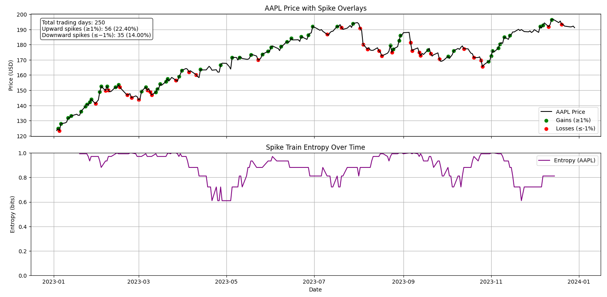
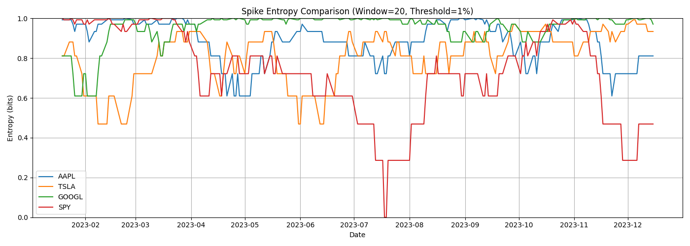
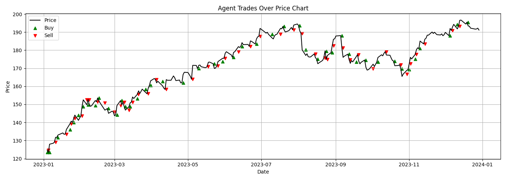
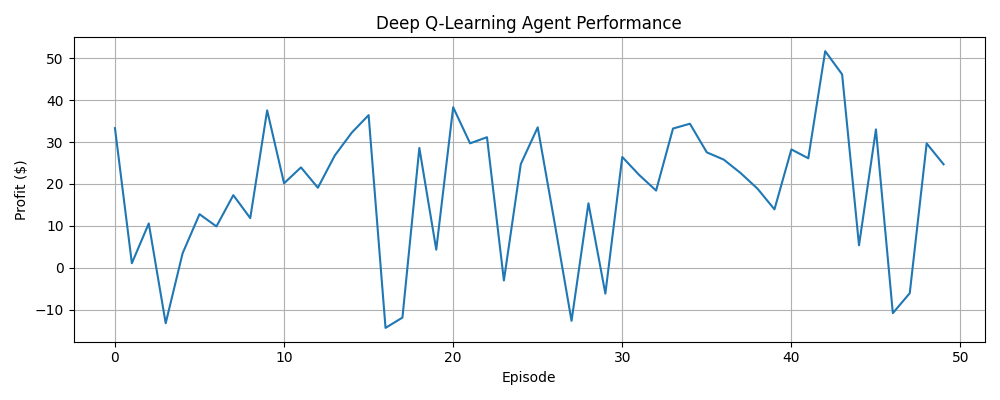

#  Brain-Inspired Stock Trader

A neuron(actual neuron) inspired reinforcement learning system for trading financial markets using spike detection and entropy dynamics.

---

##  Overview

This project draws inspiration from **spike trains in neural systems** to detect significant price movements (days where there are ≥1% increase from a previous day that had a ≥1%) in stock data. It computes **Shannon entropy** over spike windows to capture regularity and surprise in market activity, which becomes input for an intelligent **Deep Q-Learning agent** that learns optimal buy/sell/hold strategies.

---

##  Project Structure

```
project-patterns/
│
├── main.py                    # Orchestrates the full pipeline
│
├── agents/
│   └── dqn_agent.py           # Deep Q-Network agent class(Highly commented for clear explanations of basic learning models)
│
├── data/
│   └── sample_aapl.csv        # Example CSV file from yfinance
│
├── Entropy/
│   └── entropy_core.py        # Shannon entropy calculator
│
├── utils/
│   ├── analysis.py            # Signal and entropy analyzer per stock
│   ├── simulator.py           # Rule-based spike trader
│   └── market_env.py          # Custom gym-like RL environment
│
├── model/
│   └── cumulative_trader.pth  # Saved multi-run trained DQN model
│
├── figures/                   
│   ├── dqn_performance.png
│   ├── entropy_comparison.png
│   ├── spike_entropy_overlay.png
│   └── trade_viz.png
│
├── .gitignore
└── requirements.txt
```

---

##  Core Concepts

- **Spike Detection:** A spike is defined as a day-to-day price increase or decrease of ≥1%.
- **Entropy Windowing:** Calculates entropy over binary spike trains to capture regularity or volatility in behavior.
- **Reinforcement Learning:** A Deep Q-Learning agent takes `[spike, entropy]` as state and learns actions: `buy`, `sell`, or `hold`.

---

##  How It Works

1. **Analyze Stock:**
   - Uses `analyze_single_stock()` to compute spike trains and entropy curves of specific stocks.
2. **Simulate Trading:**
   - Uses `simulate_spike_trading()` as a baseline spike-only rule agent, this is an intentionally dumb rule, this is to demonstrate the very simplistic rule.
3. **Train Agent:**
   - Trains a DQN agent via environment feedback.
   - Model is saved with `torch.save()` and incrementally improved with each run, so that it is used for more context for following runs.

---

##  Intelligent Agent

- **Inputs:** `[spike_flag, entropy_value]` for each timestep.
- **Actions:** `Buy`, `Sell`, `Hold`.
- **Rewards:** Profit/loss on valid sell, 0 otherwise.
- **Exploration:** ε-greedy policy with decay.

---

##  Multi-Stock Multi-Year Training

Agent can be trained sequentially across multiple years and tickers:

```python
training_runs = [("AAPL", 2021), ("TSLA", 2022), ("SPY", 2023)]
```

Model is updated and saved to `model/cumulative_trader.pth` after every run. Running the code multiple times retains memory and makes the performance better.

---

##  Sample Outputs

### Spike + Entropy Overlays  


---

### Multi-Ticker Entropy Comparison  


---

### Rule-Based Trade 


---

### DQN Training Performance  


---

##  Requirements

```bash
pip install -r requirements.txt
```

<details>
<summary>requirements.txt</summary>

```
torch
numpy
pandas
matplotlib
yfinance
```
</details>

---

##  Run

```bash
python main.py
```

You can customize:
- Ticker symbols
- Thresholds
- Years
- Training episodes
- Window size for entropy

---

##  Try on New Data

To evaluate performance on unseen data (e.g. AAPL in 2024), simply update this block and uncomment:

```python
# === EVALUATION ON NEW DATA ===
test_data = analyze_single_stock("AAPL", threshold, window_size, "2024-01-01", "2024-12-31")
env = MarketEnv(test_data["prices"], spike_indices, test_data["entropy_values"])
agent.load_model("model/cumulative_trader.pth")
```

---

##  Future Work(This is a continuously evolving work)

- Live inference on streaming market data
- Web UI for uploading and visualizing tickers
- Incorporate volume, volatility, or sentiment features
- Explore actor-critic, PPO, or Transformer-based agents

---

##  Target Audience

- Quant/ML recruiters 
- Interdisciplinary researchers 
- Anyone curious how neural signal ideas can drive smart trading decisions

---

##  Built by

**Neud Estifanoes**  
Georgia Tech Computer Science + Neuroscience


---

## ⭐️ Star This Repo if You Enjoy It!
